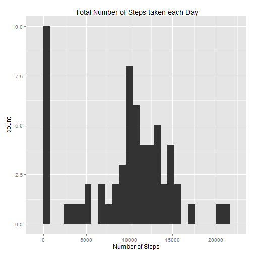
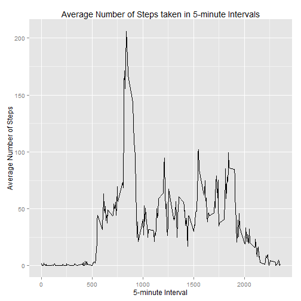
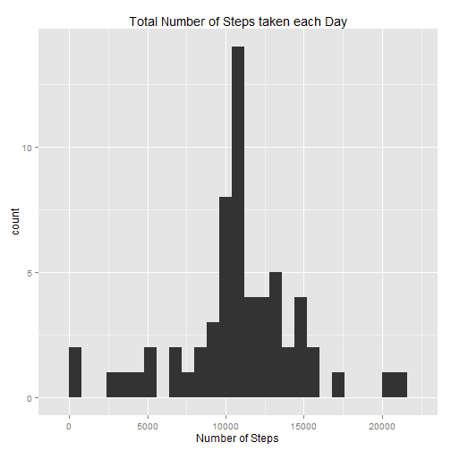
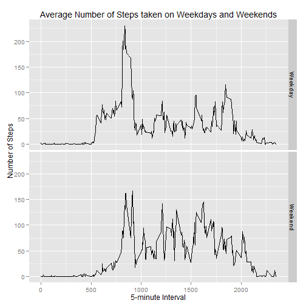

## Coursera: Reproducible Research
## Peer Assessment 1
### Purpose: To create reproducible research using RMarkdown

==========================================================================================

### Source of the data
#### Description:
Data were collected from an anonymous individual over a two-month period
(October - November, 2012) in which a personal activity monitoring device was employed
to collect information on the number of steps taken in 5 minute intervals each day.
The variables included in this dataset are:

- **steps**: Number of steps taking in a 5-minute interval (missing values are coded as NA)

- **date**: The date on which the measurement was taken in YYYY-MM-DD format

- **interval**: Identifier for the 5-minute interval in which measurement was taken

### Loading and preprocessing the data

```r
setwd("c:/Coursera_Spec/Course5_RepResearch")
Activity_data <- read.csv("activity.csv", sep = ",")
str(Activity_data)
```

```
## 'data.frame':	17568 obs. of  3 variables:
##  $ steps   : int  NA NA NA NA NA NA NA NA NA NA ...
##  $ date    : Factor w/ 61 levels "2012-10-01","2012-10-02",..: 1 1 1 1 1 1 1 1 1 1 ...
##  $ interval: int  0 5 10 15 20 25 30 35 40 45 ...
```
###Part 1. Exploring the data: Mean total number of steps taken per day

#### (i) Total number of steps taken per day:

```r
Total_Steps <- tapply(Activity_data$steps, Activity_data$date, sum, na.rm = TRUE)
Total_Steps
```

```
## 2012-10-01 2012-10-02 2012-10-03 2012-10-04 2012-10-05 2012-10-06 
##          0        126      11352      12116      13294      15420 
## 2012-10-07 2012-10-08 2012-10-09 2012-10-10 2012-10-11 2012-10-12 
##      11015          0      12811       9900      10304      17382 
## 2012-10-13 2012-10-14 2012-10-15 2012-10-16 2012-10-17 2012-10-18 
##      12426      15098      10139      15084      13452      10056 
## 2012-10-19 2012-10-20 2012-10-21 2012-10-22 2012-10-23 2012-10-24 
##      11829      10395       8821      13460       8918       8355 
## 2012-10-25 2012-10-26 2012-10-27 2012-10-28 2012-10-29 2012-10-30 
##       2492       6778      10119      11458       5018       9819 
## 2012-10-31 2012-11-01 2012-11-02 2012-11-03 2012-11-04 2012-11-05 
##      15414          0      10600      10571          0      10439 
## 2012-11-06 2012-11-07 2012-11-08 2012-11-09 2012-11-10 2012-11-11 
##       8334      12883       3219          0          0      12608 
## 2012-11-12 2012-11-13 2012-11-14 2012-11-15 2012-11-16 2012-11-17 
##      10765       7336          0         41       5441      14339 
## 2012-11-18 2012-11-19 2012-11-20 2012-11-21 2012-11-22 2012-11-23 
##      15110       8841       4472      12787      20427      21194 
## 2012-11-24 2012-11-25 2012-11-26 2012-11-27 2012-11-28 2012-11-29 
##      14478      11834      11162      13646      10183       7047 
## 2012-11-30 
##          0
```

#### (ii) Histogram of total number of steps taken each day using the ggplot2 plotting system:

```r
library(ggplot2)
qplot(Total_Steps, binwidth = 800, xlab = "Number of Steps", main = "Total Number of Steps taken each Day")
```

 

#### (iii) The mean and median of the total number of steps taken per day:

```r
mean(Total_Steps, na.rm= TRUE)
```

```
## [1] 9354.23
```

```r
median(Total_Steps, na.rm = TRUE)
```

```
## [1] 10395
```
### Part 2.  Examining the average daily activity pattern

#### (i) Time series plot of the average number of steps taken, averaged across all days:


```r
Average_NumSteps <- aggregate(x = list(steps = Activity_data$steps), 
      by = list(interval = Activity_data$interval), mean, na.rm = TRUE)
ggplot(Average_NumSteps, aes(x = interval, y = steps)) + geom_line() + xlab("5-minute Interval") + 
      ylab("Average Number of Steps") + ggtitle("Average Number of Steps taken in 5-minute Intervals")
```

 

#### (ii) 5-minute interval that contains the maximum number of steps:

```r
Average_NumSteps[which.max(Average_NumSteps$steps), ]
```

```
##     interval    steps
## 104      835 206.1698
```

### Part 3.  Imputing missing values

#### (i) Total number of missing values in the dataset:

```r
missing <- is.na(Activity_data$steps)
table(missing)
```

```
## missing
## FALSE  TRUE 
## 15264  2304
```

#### (ii) Impute the mean of the 5-minute interval for each missing value:

```r
fill_strategy <- function(steps, interval) {
      filled <- NA
      if (!is.na(steps)) 
            filled <- c(steps) 
      else 
            filled <- (Average_NumSteps[Average_NumSteps$interval == interval, "steps"])
      return(filled)
}
```

#### (iii) New dataset equivalent to the original dataset with the missing data filled in:

```r
Complete_data <- Activity_data
Complete_data$steps <- mapply(fill_strategy, Complete_data$steps, Complete_data$interval)
```

#### (iv) Histogram of total number of steps taken each day:

```r
Total_Steps <- tapply(Complete_data$steps, Complete_data$date, sum)
qplot(Total_Steps, binwidth = 800, xlab = "Number of Steps", main = "Total Number of Steps taken each Day")
```

 

#### The mean and median total number of steps taken per day:

```r
mean(Total_Steps)
```

```
## [1] 10766.19
```

```r
median(Total_Steps)
```

```
## [1] 10766.19
```

#### Comparison of summary statistics from Part 1(iii), data with missing values, and Part 3(iii), data with imputed values: 

- Mean and median values are higher after imputing means for missing values.  The increase in the mean number of steps is approximately 1412 steps.  The increase in the median number of steps is approximately 371.

- Mean and median values are equal in the imputed data set.

- Reason: In summary statistics calculations, missing values for number of steps in the original data, labelled as NAs in the data, are set to 0 by default.  Replacing these missing number of steps values with the mean number of steps of the associated interval value increases the values of these statistics. In addition, the mean is affected by extreme values (zeros) but the median is more robust to extreme values.


### Part 4. Examining differences in activity patterns between weekdays and weekends

#### (i) New factor variable for classifying dates as weekday or weekend day: *Weekday* and *Weekend*

```r
wkday_wkend <- function(date) {
      day <- weekdays(date)
      if (day %in% c("Monday", "Tuesday", "Wednesday", "Thursday", "Friday")) 
            return("Weekday") 
      else if (day %in% c("Saturday", "Sunday")) 
                  return("Weekend") 
      else stop("invalid date")
}

Complete_data$date <- as.Date(Complete_data$date)
Complete_data$day <- sapply(Complete_data$date, wkday_wkend)
```

#### (ii) Panel plot: Time series plots of average number of steps taken on weekdays and weekends:

```r
Average_NumSteps <- aggregate(steps ~ interval + day, data = Complete_data, mean)
ggplot(Average_NumSteps, aes(interval, steps)) + geom_line() + facet_grid(day ~ .) + 
      xlab("5-minute Interval") + ylab("Number of Steps") + 
      ggtitle("Average Number of Steps taken on Weekdays and Weekends")
```

 

